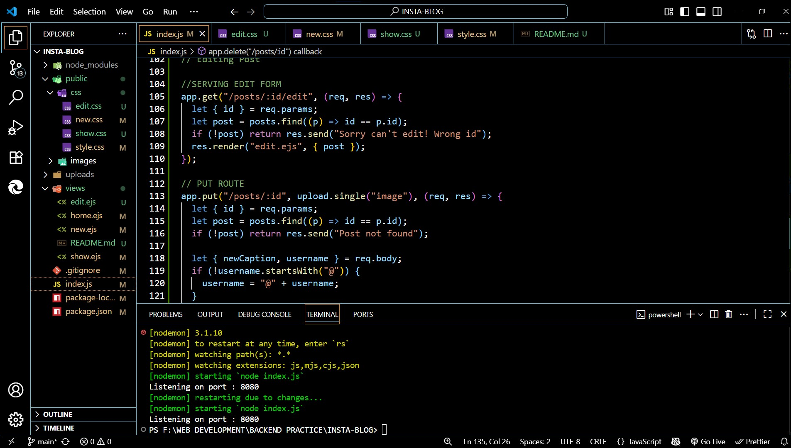
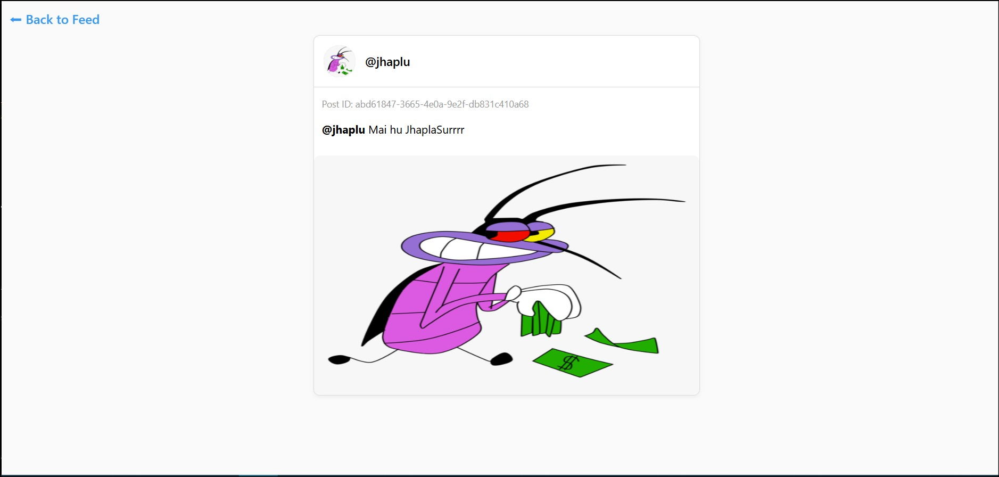
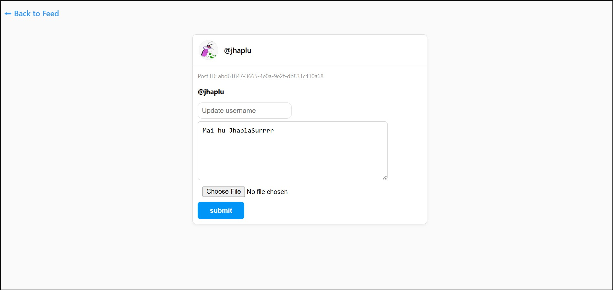

Insta-Blog

A simple Instagram-like blog built with Node.js, Express, EJS, and Multer for image uploads.

🚀 Features

View all posts

View a single post by ID

Create a new post with image upload

Edit and update existing posts

Delete posts

📝 API Endpoints

Get all posts: Retrieve a list of all posts

Get a post by ID: Retrieve a single post using its ID

Create a post: Add a new post with caption and optional image

Update a post: Edit a post’s caption and optionally replace its image

Delete a post: Remove a post by ID

⚡ Installation & Setup

Clone the repository and navigate to the project folder.

Install project dependencies using Node.js.

Start the server with Node or use nodemon for automatic restart.

Open the browser and go to the /posts route to view the app.

## 🏠 Screenshots

### Code Base
Displays the project file structure  

### Home Page
View all posts in a list  

### Post in Detail
See an individual post with caption and image  

### Edit Post
Form to edit captions and update images  

🔮 Future Improvements

Add user authentication (login/signup)

Store posts in a real database (MongoDB or PostgreSQL)

Add likes and comments functionality

Improve the UI with advanced styling