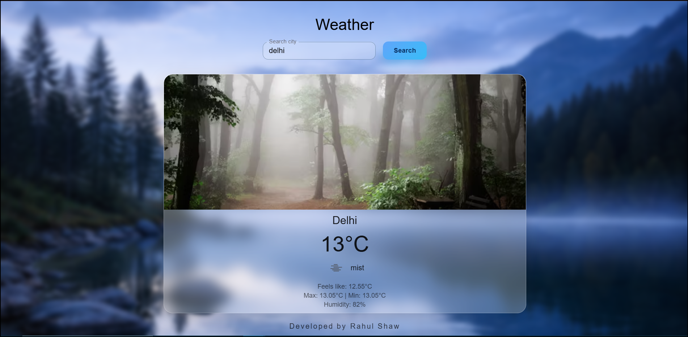
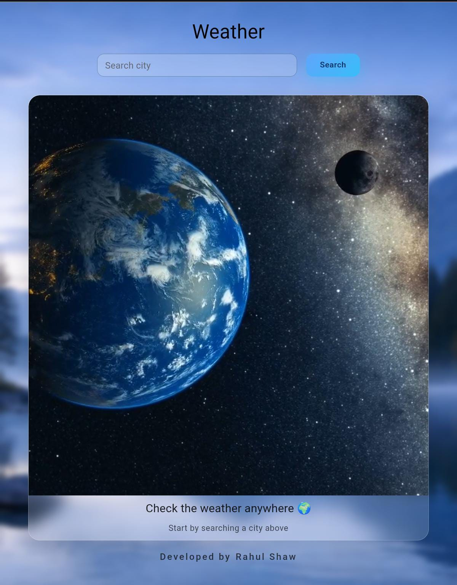
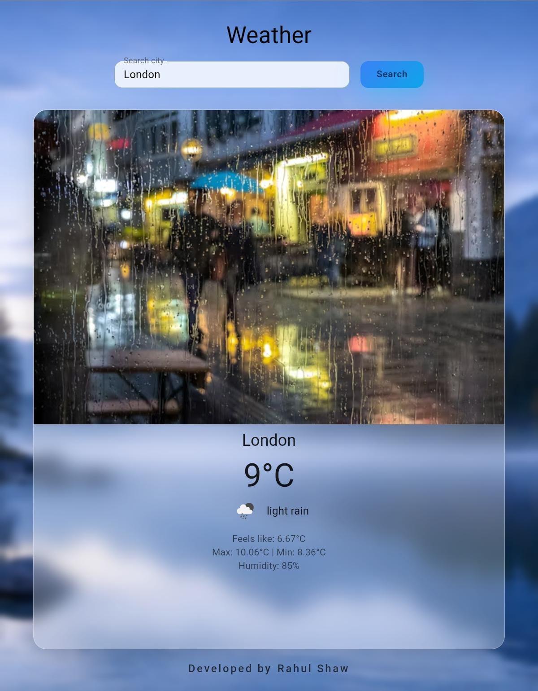

# ☁️ Weather App

A modern, responsive Weather Application built using React.js and Material UI, allowing users to search for any city and view real-time weather information instantly.

---

## 🚀 Live Demo

👉 Live Preview:  
https://weatherapp-gules-sigma-87.vercel.app/

---

## 📸 Project Screenshots

### 💻 Desktop View

### 📱 Mobile View

---

## 🛠️ Tech Stack

- React.js  
- Material UI (MUI)  
- OpenWeather API  
- JavaScript (ES6+)  
- CSS / MUI SX System  

---

## 📌 Features

- Search weather by city name  
- Displays temperature, humidity, and weather conditions  
- Fully responsive design (mobile & desktop)  
- Error handling for invalid or empty city names  
- Loading states for better user experience  
- Clean and modern UI using Material UI  
- Optimized for mobile keyboard behavior  

---

## 🧠 What I Learned

- Fetching and handling external APIs in React  
- State management and conditional rendering  
- Error handling and edge cases  
- Using Material UI components and responsive breakpoints  
- Improving mobile-first UX  
- Writing clean, reusable React components  

---

## 📂 Project Structure

weather-app/
├── public/
│   └── screenshots/
│       ├── weather-app-desktop.png
│       ├── weather-app-desktop1.png
│       ├── weather-app-mobile.jpeg
│       └── weather-app-mobile1.jpeg
├── src/
│   ├── components/
│   │   ├── Weather.jsx
│   │   ├── WeatherInfo.jsx
│   │   ├── WeatherPlaceholder.jsx
│   │   └── Credit.jsx
│   ├── App.jsx
│   ├── main.jsx
│   └── index.css
├── package.json
└── README.md

---

## ⚙️ Setup & Installation

### 1. Clone the repository
git clone https://github.com/CODER-RAHUL9038/weather-app.git

### 2. Navigate to the project folder
cd weather-app

### 3. Install dependencies
npm install

### 4. Start the development server
npm run dev

The app will run on:
http://localhost:5173/

---

## 🔐 Environment Variables

Create a .env file in the root directory and add:

VITE_WEATHER_API_KEY=your_openweather_api_key

Get your API key from:
https://openweathermap.org/api

---

## ❗ Error Handling

- Shows user-friendly messages for invalid city names  
- Prevents API calls when input is empty  
- Gracefully handles API and network failures  

---

## 📱 Mobile Optimization

- Auto-blur input after search to hide keyboard  
- Prevents layout breaking on small screens  
- Responsive spacing using MUI breakpoints  

---

## 🚧 Future Improvements

- Auto-detect user location  
- Dark / Light mode toggle  
- 5-day weather forecast  
- Weather animations and icons  
- Recent search history  

---

## 🤝 Contributing

Contributions are welcome.  
Feel free to fork this repository and submit a pull request.

---

## 📜 License

This project is licensed under the MIT License.

---

## 👨‍💻 Author

Rahul Shaw  
GitHub: https://github.com/CODER-RAHUL9038  
LinkedIn: Rahul Shaw  

---

⭐ If you like this project, don’t forget to star the repository!
