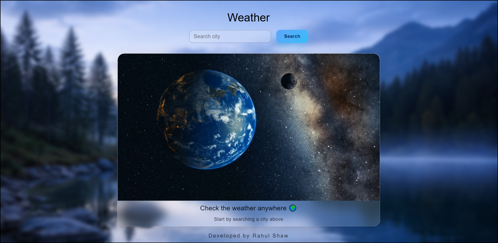
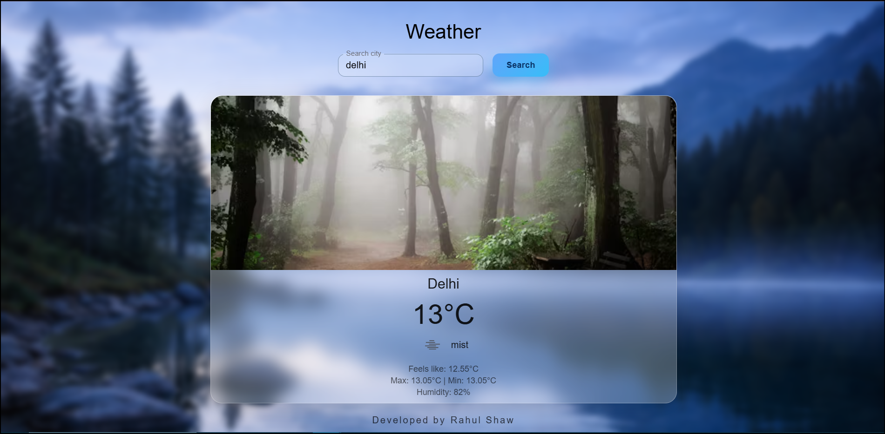
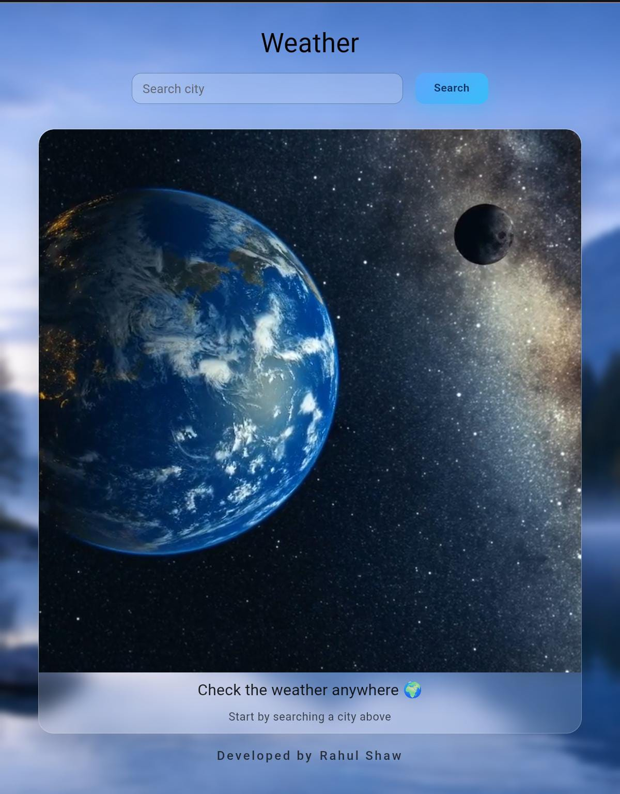
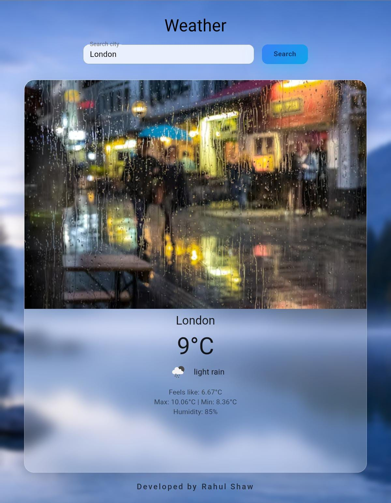

# ☁️ Weather Sky - Real-Time Weather Forecast

[](https://react.dev/)
[](https://mui.com/)
[](https://vitejs.dev/)
[](LICENSE)

A high-performance, responsive weather application that provides real-time weather updates with a sleek, modern UI. Built with React 19 and Material UI, featuring a smooth user experience and dynamic data fetching.

🔗 **[Live Demo](https://weatherapp-gules-sigma-87.vercel.app/)**

---

## ✨ Features

- 🔍 **Global City Search:** Get instant weather data for any city worldwide.
- 🌡️ **Comprehensive Data:** View temperature, humidity, wind speed, and weather conditions.
- 📱 **Adaptive UI:** Fully responsive design optimized for mobile, tablet, and desktop.
- 🎨 **Modern Aesthetics:** Clean interface built using Material UI's robust component library.
- ⚡ **Real-time Updates:** Powered by the OpenWeatherMap API for accurate information.
- 🛠️ **Developer Friendly:** Clean code architecture using React hooks and modular components.

---

## 📸 Screenshots

### 🖥️ Desktop Experience
<div align="center">
  
  
</div>

### 📱 Mobile Experience
<div align="center">
  
  
</div>

---

## 🛠️ Tech Stack

- **Frontend:** [React 19](https://react.dev/)
- **UI Framework:** [Material UI (MUI) v7](https://mui.com/)
- **Styling:** [Emotion](https://emotion.sh/) (Styled Components) & CSS Modules
- **Build Tool:** [Vite](https://vitejs.dev/)
- **API:** [OpenWeatherMap API](https://openweathermap.org/api)

---

## 📂 Project Structure

```text
weather-app/
├── public/
│   └── screenshots/          # Application screenshots
├── src/
│   ├── assets/               # Static assets (images, icons)
│   ├── App.jsx               # Main application container
│   ├── WeatherApp.jsx        # Core logic & state management
│   ├── WeatherCard.jsx       # Weather display component
│   ├── SearchButton.jsx      # Search input & button component
│   ├── Credit.jsx            # Footer/Credit component
│   ├── App.css               # Global & Component styles
│   └── main.jsx              # Entry point
├── package.json              # Dependencies & scripts
└── README.md                 # Documentation
```

---

## 🚀 Getting Started

Follow these steps to set up the project locally:

### 1. Clone the Repository
```bash
git clone https://github.com/CODER-RAHUL9038/weather-app.git
cd weather-app
```

### 2. Install Dependencies
```bash
npm install
```

### 3. Configure Environment Variables
Create a `.env` file in the root directory and add your API keys:
```env
VITE_WEATHER_API_URL=https://api.openweathermap.org/data/2.5/weather
VITE_WEATHER_API_KEY=your_openweather_api_key_here
```

### 4. Run the Development Server
```bash
npm run dev
```
Open `http://localhost:5173` in your browser.

---

## 📦 Building for Production

To create an optimized production build:
```bash
npm run build
```
The output will be generated in the `dist/` folder.

---

## 🤝 Contributing

Contributions are what make the open-source community such an amazing place to learn, inspire, and create. Any contributions you make are **greatly appreciated**.

1. Fork the Project
2. Create your Feature Branch (`git checkout -b feature/AmazingFeature`)
3. Commit your Changes (`git commit -m 'Add some AmazingFeature'`)
4. Push to the Branch (`git push origin feature/AmazingFeature`)
5. Open a Pull Request

---

## 📜 License

Distributed under the MIT License. See `LICENSE` for more information.

---

## 👨‍💻 Author

**Rahul Shaw**
- GitHub: [@CODER-RAHUL9038](https://github.com/CODER-RAHUL9038)
- LinkedIn: [Rahul Shaw](https://www.linkedin.com/in/rahul-shaw-00/)

---

<p align="center">
  Give a ⭐ if you like this project!
</p>
